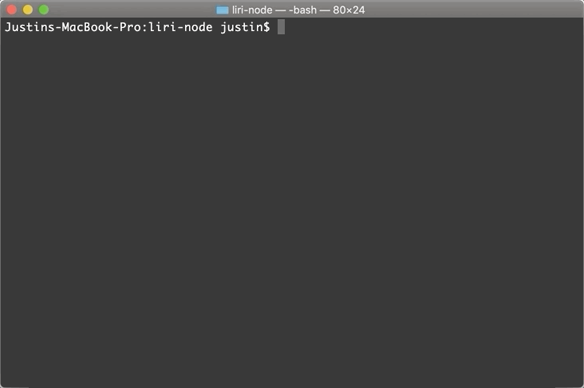

# Liri

Liri is a _Language_ Interpretation and Recognition Interface. This command line node app takes in parameters and gives you back data.

## Instructions

Install the Node Spotify API, axios, moment, and dotenv packages with:

```
npm install
```

This application uses the Spotify API and OMDB API, and it needs to be configured with your API keys. Your keys.js your file will look like this:

```
exports.spotify = {
  id: process.env.SPOTIFY_ID,
  secret: process.env.SPOTIFY_SECRET
};

exports.omdb = {
  apiKey: process.env.OMDB_APIKEY
}l
```

## Liri Commands

Liri responds to one of the following commands:

* `concert-this`
* `spotify-this-song`
* `movie-this`
* `do-what-it-says`

## concert-this

The `concert-this` command will search for an artist and return information about events coming up. To search for an artist, execute this in the command line:

```
node liri.js concert-this <artist name>`
```

Liri will return a response like this:



By invoking `concert-this`, Liri, first, makes a `GET` request to the `/artists` endpoint of the Bands in Town API to verify the input. This allows Liri to search for partial matches and respond with the name of the artist that was returned in the match. If the API response contains at least a partial match, Liri will make a second `GET` request using the `/events` endpoint to fetch events associated with the artist.

## spotify-this-song

The `spotify-this-song` command will search for a song and return information about the song. To search for a song, execute this in the command line:

`node liri.js spotify-this-song <song name>`

Liri will return a response like this:


## movie-this

The `movie-this` command will search for a movie and return information about the movie. To search for a movie, execute this in the command line:

`node liri.js movie-this <movie name>`

Liri will return a response like this:


When Liri fetches a movie, it will parse the movie's ratings for IMDB and Rotten Tomatoes ratings.

## do-what-it-says

The `do-what-it-says` command will read the `random.txt` file and perform the request from the file. To run this command, execute this in the command line:

`node liri.js do-what-it-says`

Liri will return a response like this:


## log.txt

The log.txt file contains a history of all requests and their output. 

## Technologies Used

* Node.js
* JavaScript
* Node packages
    * dotenv
    * axios
    * Node Spotify API
    * moment
* Bands in Town API
    * the `/events` endpoint returns an array of all performers at an event
    * for example, a festival can contain many artists performing
    * Liri uses the `/artists` endpoint to help scope the response, so that artist name is formatted, specifically, to the user's request
* OMDB API

## Additional Examples

### concert-this partial match

* executing this:

    ```
    node liri.js concert-this tailor swift
    ```

    will return events for for "Taylor Swift."
* [example](examples/concert_this_tailor.gif) 

### concert-this list of events

* artists may perform at multiple events
* Liri's response will list all events
* [example](examples/concert_this_gcj.gif)

### spotify-this-song default

* returns "The Sign" by Ace of Base
* purposely returns one result by passing a limit to the Spotify API
* [example](examples/spotify_this_song.gif)

### movie-this default

* returns "Mr. Nobody"
* [example](examples/movie_this.gif)

### Bad command

* returns this response:

    ```
    Liri needs one of these commands to display some information:

        concert-this
        spotify-this-song
        movie-this
        do-what-it-says
    ```


